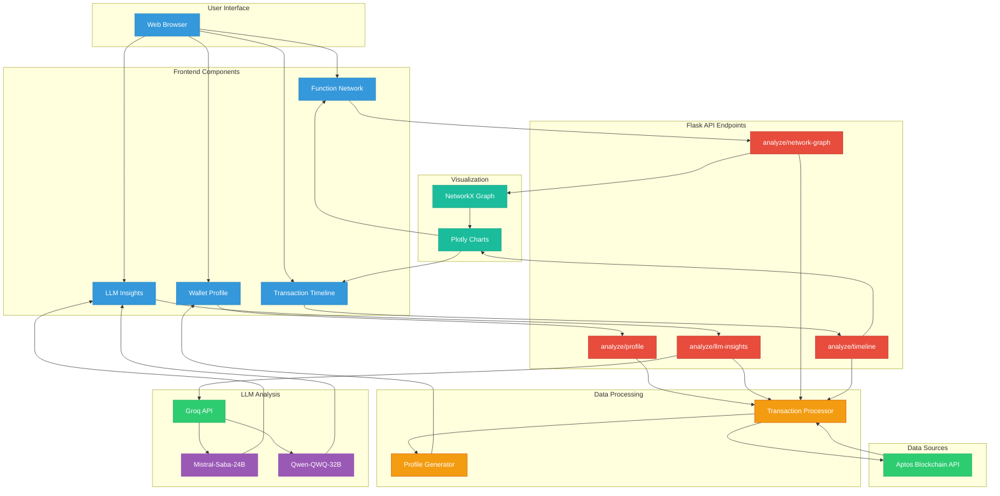

# Wallet Persona Analysis

This project is primarily aimed at profiling of wallet addresses on the aptos blockhain platform. This was chosen primariliy because of the existence of KGeN's player wallet addresses being based there along with the governing smart contracts.

## System Architecture

The following diagram illustrates the data flow and component interactions:



## Technical Implementation

### Transaction Retrieval from Aptos Blockchain
The application interacts with the Aptos blockchain through its REST API endpoints:

- **Transaction Data**: Fetched via `https://fullnode.mainnet.aptoslabs.com/v1/accounts/{address}/transactions`
- **Account Resources**: Retrieved from `https://fullnode.mainnet.aptoslabs.com/v1/accounts/{address}/resources`

Raw transaction data undergoes several processing steps:
1. **Function Name Extraction**: Isolates the module and function (e.g., `PoGNFT::update_player_score`) from fully-qualified paths
2. **Argument Cleaning**: Strips hex-encoded data while preserving readable strings
3. **Timestamp Normalization**: Converts Aptos microsecond timestamps to standard datetime format
4. **Transaction Classification**: Categorizes transactions based on function name patterns:
   - `transfer` → Transfer category
   - `swap` → Swap category
   - `pool/lend/borrow` → DeFi category
   - `nft` → NFT category

### LLM Processing and Classification

The platform uses multiple LLM models for different analytical tasks:

- **Mistral  (saba-24b)**: Powers wallet health assessment and social handle generation
- **Qwen (qwq-32b)**: Used for entity extraction and transaction pattern analysis


Raw LLM responses undergo post-processing:
1. Removal of thinking markers (`<think>...</think>`)
2. JSON parsing for structured data
3. Markdown rendering for formatted display

### Graph Visualization Techniques

#### Network Graph
The transaction function call graph uses:
- **NetworkX**: For graph construction and spring layout algorithm
- **Directed Graph Model**: Where nodes are function names and edges represent sequential calls
- **Edge Weight**: Determined by frequency of function A → function B transitions
- **Plotly**: For interactive visualization with hover details

#### Timeline Visualization
The chronological activity view implements:
- **Pandas**: For timestamp processing and function-based grouping
- **Plotly Scatter**: With x-axis representing time and y-axis showing different functions
- **Color Coding**: Different colors for different transaction types
- **Interactive Elements**: Tooltips showing transaction details on hover

## Features

### Wallet Profiling
- Basic wallet metrics (age, transaction count, activity patterns)
- Persona classification (NFT Collector, DeFi User, Long-term Holder, etc.)
- Transaction type distribution analysis
- Social identity generation (AI-generated social handle)

### Visualization
- **Network Graph**: Interactive function call network showing transaction patterns
- **Timeline Visualization**: Chronological transaction activity view
- **Transaction Table**: Detailed listing of recent wallet activity
- **Health Dashboard**: Key metrics and indicators of wallet health


### LLM-Powered Analysis

- Wallet health scoring (0-100) with strengths/weaknesses assessment
- Entity extraction from transaction data
- Username and organization identification
- Behavioral insights and patterns

## API Endpoints

The backend exposes several REST endpoints for incremental data loading:

- `/analyze/profile` - Basic wallet profile data (fast)
- `/analyze/llm-insights` - AI-generated insights about wallet behavior (may be slower)
- `/analyze/network-graph` - Function call network visualization data
- `/analyze/timeline` - Chronological transaction activity visualization

## Technologies Used

### Backend
- **Flask**: Lightweight web framework
- **NetworkX**: Graph analysis and network visualization
- **Pandas**: Data manipulation and analysis
- **Plotly**: Graph generation and serialization

### Frontend
- **Bootstrap 5**: Responsive UI framework
- **Plotly.js**: Interactive data visualizations
- **Marked.js**: Markdown rendering for LLM outputs
- **Fetch API**: Asynchronous data loading

### LLM Integration
- **Groq API**: High-performance LLM inference
- **Mistral/Qwen Models**: Advanced language models for insights generation

## Installation

1. Clone the repository
2. Install requirements:

```bash
pip install -r requirements.txt
```

3. Set up LLM API access:

```bash
# For Groq
export GROQ_API_KEY=your_api_key_here

# For OpenAI (alternative)
export OPENAI_API_KEY=your_api_key_here

## Usage

### Web Interface

1. Start the Flask web server:

```bash
python app.py
```

2. Navigate to `http://localhost:8080` in your web browser
3. Enter an Aptos wallet address and analyze
4. The UI will progressively load different insights as they become available

## Screenshots 


## Dependencies

See `requirements.txt` for a complete list of dependencies.


## License

[MIT License](LICENSE)
